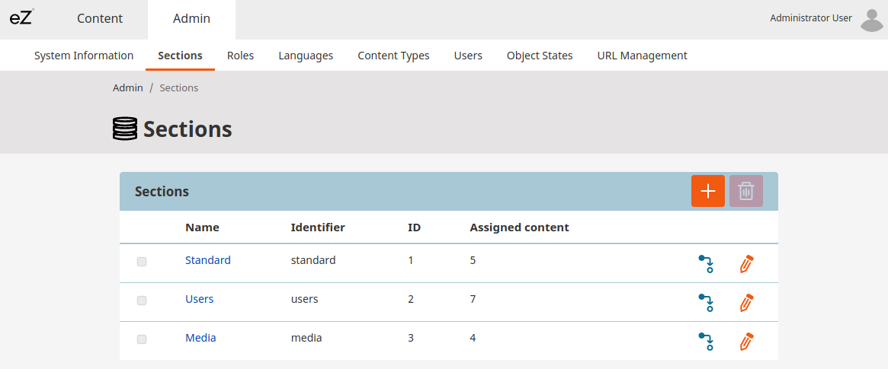
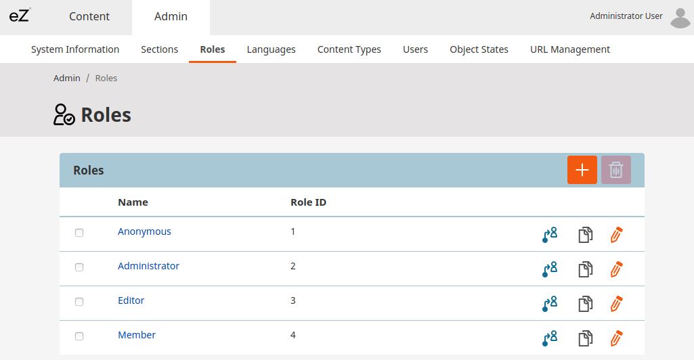
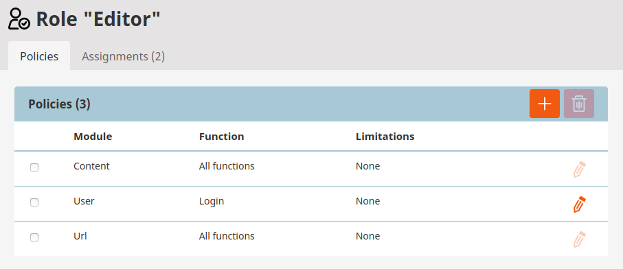
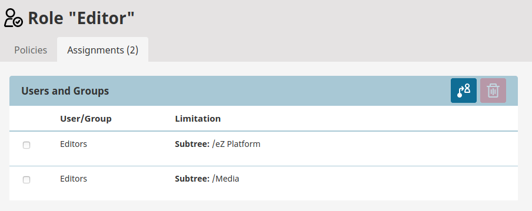
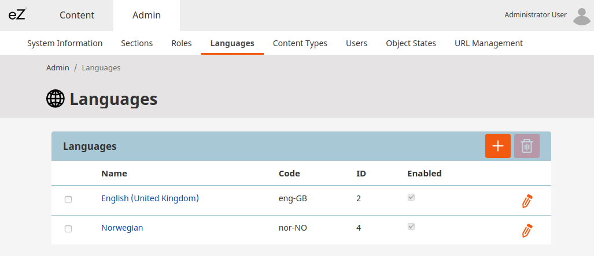
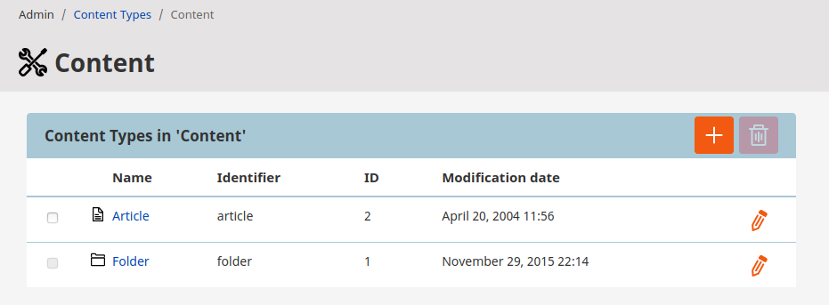
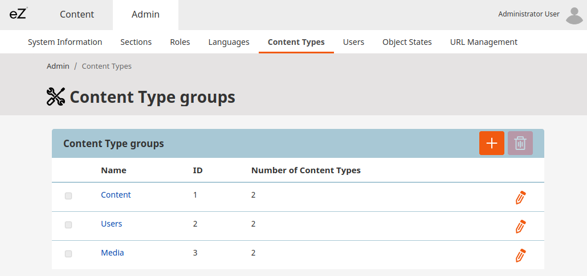
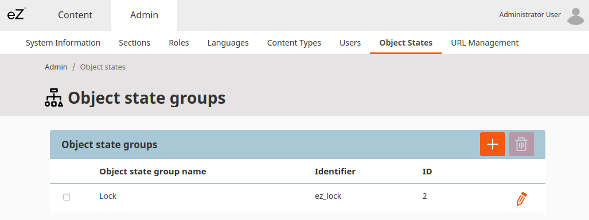

# Administration management

Once you set up your environment you can start your work as an administrator.
Your most useful tools can be found in **Admin Panel**.

## System Information

The System Information panel in the Back Office is sourced in a [ezsystems/ez-support-tools repository](https://github.com/ezsystems/ez-support-tools).
There you will also find basic system information such as versions of all installed packages.

## Sections

Sections are used to divide Content items in the tree into groups that are more easily manageable by content editors.
Division into Sections allows you, among others, to set permissions for only a part of the tree.

Technically, a Section is a number, a name and an identifier.
Content items are placed in Sections by being assigned the Section ID. One item can be in only one Section.

When a new Content item is created, its Section ID is set to the default Section (which is usually Standard).
When the item is published it is assigned to the same Section as its parent. Because content must always be in a Section, unassigning happens by choosing a different Section to move it into.
If a Content item has multiple Location assignments then it is always the Section ID of the item referenced by the parent of the main Location that will be used.
In addition, if the main Location of a Content item with multiple Location assignments is changed then the Section ID of that item will be updated.

When content is moved to a different Location, the item itself and all of its subtree will be assigned to the Section of the new Location.
Note that it works only for copy and move; assigning a new Section to a parent Content item does not affect the subtree, meaning that subtree cannot currently be updated this way.

Sections can only be removed if no Content items are assigned to them. Even then, it should be done carefully.
When a Section is deleted, it is only its definition itself that will be removed.
Other references to the Section will remain and thus the system will most likely lose consistency.

!!! caution

    Removing Sections may corrupt permission settings, template output and other things in the system.

Section ID numbers are not recycled. If a Section is removed, its ID number will not be reused when a new Section is created.

## Users

Users in eZ Platform are treated the same way as [Content Types](#content-types).
They are organized in groups such as *Guests*, *Editors*, *Anonymous*, which makes it easier to manage them and their permissions.
All User Groups and Users can be accessed in the Admin panel by selecting Users.

!!! caution

    Be careful not to delete an existing User account. If you do this, content created by this User will be broken and the application can face malfunction.

### Registering users

Registration form for your website is placed under this address: <yourdomain>/register.
By default, new Users created in this way are placed in the Guest accounts group.
If you want to give your users possibility to register themselves follow a tutorial on [enabling account registration](user_generated_content/#registering-new-users).

## Roles

To give users an access to your website you need to assign them Roles in the Admin Panel.

Each Role consists of:

**Policies**

Rules that give users access to different function in a module.
You can restrict what user can do with Limitations.
The available Limitations depend on the chosen Policy.
When Policy has more than one Limitation, all of them have to apply.
See [example below](#restrict-editing-to-part-of-the-tree).

!!! note

    Limitation specifies what a User can do, not what they can't do.
    A `Location` Limitation, for example, gives the User access to content with a specific Location, not prohibits it. See [Available Limitations](limitations.md#available-limitations) for further information.

**Assignments**

After you created all Policies, you can assign the Role to Users and/or User Groups with possible additional Limitations.
Every User or User Group can have multiple Roles.
A User can also belong to many groups, for example, Administrators, Editors, Subscribers.

Best practice is to avoid assigning Roles to Users directly.
Model your content (Content Types, Sections, Locations etc.) in a way that can be accessed by generic Roles.
That way system will be more secure and easier to manage.
This approach also improves performance. Role assignments and Policies are taken into account during search/load queries.

See [Permissions overview](permissions.md) for further information.

### Policies examples

Here are a few examples of sets of Policies you can use to get some common permission configurations.

#### Enter back end interface

To allow the User to enter the Back Office interface and view all content, you need to set the following Policies:

- `user/login`
- `content/read`
- `content/versionread`
- `section/view`
- `content/reverserelatedlist`

These Policies will be necessary for all other cases below that require access to the content structure.

!!! enterprise

    #### Create content without publishing
    
    This option can be used together with eZ Enterprise's content review options.
    Using the following Policies, the User is able to create content, but can't publish it; instead, they must send it for review to another User with proper permissions (for example, senior editor, proofreader, etc.).
    
    - `content/create`
    - `content/edit`
    
    Note that without eZ Enterprise this setup should not be used, as it will not allow the User to continue working with their content.

#### Create and publish content

To create and publish content, the user must additionally have the following Policies:

- `content/create`
- `content/edit`
- `content/publish`

This also lets the user copy and move content, as well as add new Locations to a Content item (but not remove them!).

#### Removing content

To send content to Trash, the User needs to have the `content/remove` Policy.

To remove an archived version of content, the User must have the `content/versionremove` Policy.

Further manipulation of Trash requires the `content/restore` Policy to restore items from Trash, and `content/cleantrash` to completely delete all content from Trash.

#### Restrict editing to part of the tree

If you want to let the User create or edit content, but only in one part of the content tree, you need to use Limitations.
Three Limitations that could be used here are `Section` Limitation, `Location` Limitation and `Subtree of Location` Limitation.

##### Section Limitation

Let's assume you have two Folders under your Home: Blog and Articles.
You can let a User create content for the blogs, but not in Articles by adding a `Section` Limitation the Blog Content item.
This will allow the User to publish content anywhere under this Location in the structure.
Section does not have to belong to the same Subtree of Location in the content structure, any Locations can be assigned to it.

##### Location Limitation

If you add a `Location` Limitation and point to the same Location, the User will be able to publish content directly under the selected Location, but not anywhere deeper in its Subtree of Location.

##### Subtree of Location Limitation

If you want to limit User's access to a subtree you need to use the `Subtree of Location` Limitation.
To do so, you need to create two new Roles for a User Group:
 
 1. Role with a `Subtree` Limitation for the User
 1. Role with a `Location` Limitation for the Subtree

Follow the example below to learn how to do that.

**Cookbook**, **Dinner recipes** and **Dessert recipes** containers are not accessible in the frontend, so you need to edit access to them in the **Admin Panel**. 

To give the vegetarian editors access only to the **Vegetarian** dinner recipes section create a new Role e.g. *EditorVeg*.
Next, add to it a `content/read` Policy with the `Subtree` Limitation for `Cookbook/Dinner recipes/Vegetarian`.
Assign the Role to the vegetarian editors User Group.
It will allow users from that group to access the **Vegetarian** container but not **Cookbook** and **Dinner recipes**.

To give users access to **Cookbook** and **Dinner recipes** containers you need to
create a new Role e.g. *EditorVegAccess*.
Next, add to it a `content/read` Policy with the `Location` Limitations **Cookbook** and **Dinner recipes**.
Assign the new Role to the vegetarian editors User Group as well.
Only then the limitations are combined with `AND` resulting in an empty set.

The vegetarian editors should now see the following Content Tree:

Note that when a Policy has more than one Limitation, all of them have to apply, or the Policy will not work.
For example, a `Location` Limitation on Location `1/2` and `Subtree of Location` Limitation on `1/2/55` cannot work together, because no Location can satisfy both those requirements at the same time.
If you want to combine more than one Limitation with the *or* relation, not *and*, you can split your Policy in two, each with one of these Limitations.

!!! enterprise

    #### Editorial workflows

    You can control which stages in an editorial workflow the user can work with.

    Do this by adding the `WorkflowStageLimitation` to `content` Policies such as `content/edit` or `content/publish`.

    You can also control which transitions the user can pass content through.
    Do this by using the `workflow/change_stage` Policy together with the `WorkflowTransitionLimitation`.

    For example, to enable the user to edit only content in the "Design" stage
    and to pass it after creating design to the "Proofread stage", use following permissions:

    - `content/edit` with `WorkflowStageLimitation` set to "Design".
    - `workflow/change_stage` with `WorkflowTransitionLimitation` set to `to_proofreading`

For more examples, see [Permissions use cases](permissions/#use-cases).

## Languages

eZ Platform offers the ability to create multiple translations of your website.
Which version is shown to a visitor depends on the way your installation is set up.
A new language version for the website can be added in the Admin Panel in the Languages tab.
Every new language must have a name and a language code, written in the `xxx-XX` format, for example `eng-GB` etc.

The multilanguage system operates based on a global translation list that contains all languages available in the installation.
After adding a language you may have to reload the application to be able to use it.
Depending on your set up, additional configuration may be necessary for the new language to work properly, especially with SiteAccesses.

See [Languages](internationalization.md) for further information.

## Content Types

A Content Type is a base for new Content items.
It defines what Fields will be available in the Content item.

For example, a new Content Type called *Article* can have Fields such as title, author, body, image, etc.
Based on this Content Type, you can create any number of Content items.
Content Types are organized into groups.

You can add your own groups here to keep your Content Types in better order.

For a full tutorial, see [Create a Content Type](../getting_started/first_steps/#create-a-content-type) or follow [user documentation](https://doc.ezplatform.com/projects/userguide/en/latest/organizing_the_site/#content-types).
For a detailed overview of the content model, see [Content model overview](content_model.md).

## Object States

Object states are user-defined states that can be assigned to Content items.
They are contained in groups.

If a state group contains any states, each Content item is automatically assigned a state from this group.

You can assign states to content in the Back Office in the Content item's Details tab.

By default, eZ Platform contains one Object state group: **Lock**, with states **Locked** and **Not locked**.

Object states can be used in conjunction with permissions, in particular with the [State Limitation](limitation_reference.md#state-limitation).
Their specific use cases depend on your needs and the setup of your permission system.
